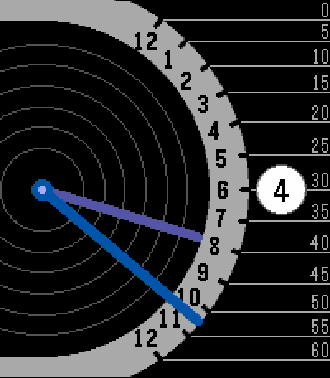

# Pebble Retrograde Watchface

This is a Pebble watchface heavily inspired by the [Xeric Timeline Retrograde](https://www.xeric.com/collections/timeline-retrograde-automatic-watches/products/timeline-retrograde-automatic-prism-tla-1139-01b). 

[Download it on the rePebble App Store](https://apps.repebble.com/retrograde_968b7e2ad0a4495ba4b0f50f)

## Screenshots

## Build

You must have [`just`](https://github.com/casey/just), and the [Pebble SDK](https://developer.repebble.com/sdk/) installed. This was built on version 4.9.148 of the SDK, but newer versions are likely still supported.

Once installed, you can run `just build` to build the pbw file.
